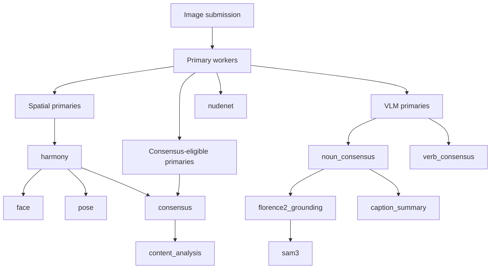

# Workflow Map

This document describes Windmill's internal workflow relationships.

It is documentation only. It is not loaded by code, and operators should not treat it as configuration.

Windmill also exposes the machine-readable form of this contract at `GET /workflow`.

The runtime sources of truth remain:

- [core/dispatch.py](/home/sd/windmill/core/dispatch.py) for expected downstream computation
- [workers/base_worker.py](/home/sd/windmill/workers/base_worker.py) for primary downstream triggers
- [workers/harmony_worker.py](/home/sd/windmill/workers/harmony_worker.py) for spatial postprocessing and consensus retrigger
- [workers/noun_consensus_worker.py](/home/sd/windmill/workers/noun_consensus_worker.py) for grounding and caption-summary triggers
- [workers/consensus_worker.py](/home/sd/windmill/workers/consensus_worker.py) for content-analysis trigger

## Primary Submission Contract

Primary queue messages are expected to carry:

- `image_id`
- `image_filename`
- `image_data`
- `tier`
- `trace_id`

`trace_id` is used for primary-result idempotency.

## Processing Graph

## Expected Downstream Conditions

These conditions document what `compute_expected_downstream()` currently models.

| Downstream stage | Expected when |
|---|---|
| `harmony` | at least one spatial primary was submitted and the tier allows `system.harmony` |
| `consensus` | at least one submitted primary has `consensus: true` and the tier allows `system.harmony` |
| `noun_consensus` | at least one submitted primary is a VLM |
| `verb_consensus` | at least one submitted primary is a VLM |
| `sam3` | at least one submitted primary is a VLM and the tier allows `system.sam3` |
| `caption_summary` | at least two submitted primaries are VLMs and the tier allows `system.caption_summary` |
| `content_analysis` | `nudenet` was submitted and the tier allows `system.content_analysis` |
| `florence2_grounding` | `florence2` was submitted |

## Important Nuances

- `consensus` is currently expected using the same tier gate as `system.harmony` because that is how [core/dispatch.py](/home/sd/windmill/core/dispatch.py) is written today.
- `harmony` retriggers `consensus` after merged boxes are updated.
- `noun_consensus` triggers `florence2_grounding` progressively and may do so more than once as VLM results arrive.
- `caption_summary` is progressive and can retrigger as additional captions arrive.
- `colors_post` is declared in the postprocessing area of the config, but it is not currently dispatched in the active harmony code path.

## Why This Is Markdown, Not YAML

This used to exist as a top-level `workflow.yaml` proposal, but that was too easy to misread as live configuration.

This Markdown document is intentionally:

- documentation-only
- safe for operators to ignore during deployment
- explicit about where the real runtime logic lives

The machine-readable/client-consumable form lives in code and is served by the API.
