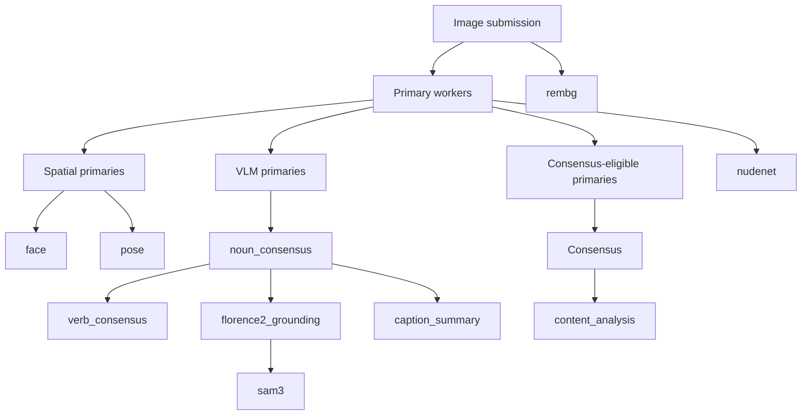

# Workflow Map

This document describes Windmill's internal workflow relationships.

It is documentation only. It is not loaded by code, and operators should not treat it as configuration.

Windmill also exposes the machine-readable form of this contract at `GET /workflow`.

The runtime sources of truth remain:

- [core/dispatch.py](/home/sd/windmill/core/dispatch.py) for expected downstream computation
- [workers/base_worker.py](/home/sd/windmill/workers/base_worker.py) for primary downstream triggers
- [workers/noun_consensus_worker.py](/home/sd/windmill/workers/noun_consensus_worker.py) for verb-consensus production, grounding, and caption-summary triggers

## Primary Submission Contract

Primary queue messages are expected to carry:

- `image_id`
- `image_filename`
- `image_data`
- `tier`
- `trace_id`

`trace_id` is used for primary-result idempotency.

## Processing Graph

## Expected Downstream Conditions

These conditions document what `compute_expected_downstream()` currently models.

| Downstream stage | Expected when |
|---|---|
| `noun_consensus` | at least one submitted primary is a VLM |
| `verb_consensus` | at least one submitted primary is a VLM |
| `sam3` | at least one submitted primary is a VLM and the tier includes the `system.sam3` service |
| `caption_summary` | at least two submitted primaries are VLMs and the tier includes the `system.caption_summary` service |
| `content_analysis` | `nudenet` was submitted and the tier includes the `system.content_analysis` service |
| `rembg` | the tier includes the `system.rembg` service |
| `florence2_grounding` | `florence2` was submitted |

## Important Nuances

- `system.caption_summary`, etc. are full service identifiers, not names of a separate `system` tier.
- `verb_consensus` remains a logical downstream artifact, but it is produced inside [workers/noun_consensus_worker.py](/home/sd/windmill/workers/noun_consensus_worker.py) rather than by a dedicated worker.
- `noun_consensus` now delays `florence2_grounding` until the full tier VLM set has reported.
- `caption_summary` is also delayed until the full tier VLM set has reported.
- `content_analysis` is likewise delayed until the full tier VLM set has reported.
- `rembg` is producer-triggered rather than worker-triggered in the current deployment model, but it is still part of the expected downstream product set.
- `colors_post` is declared in the postprocessing area of the config, but it is not currently dispatched in the active harmony code path.

## Why This Is Markdown, Not YAML

This used to exist as a top-level `workflow.yaml` proposal, but that was too easy to misread as live configuration.

This Markdown document is intentionally:

- documentation-only
- safe for operators to ignore during deployment
- explicit about where the real runtime logic lives

The machine-readable/client-consumable form lives in code and is served by the API.
